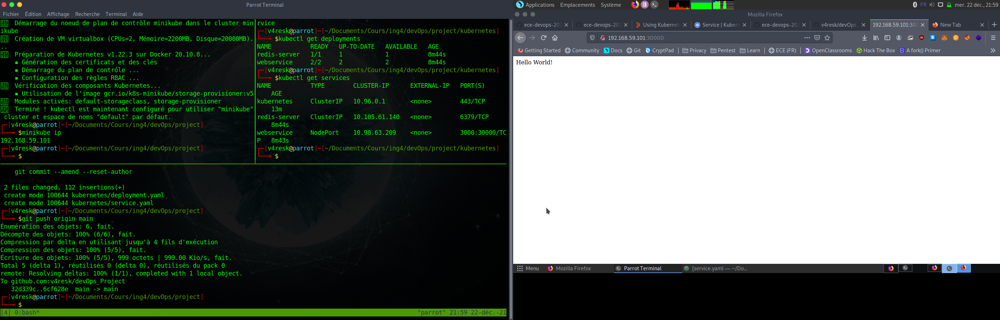

# Intro

This is a DevOps project using different tools in order to ensure CI/CD

# Work done
 - Creation of an API web application with node.js and redis
 - CI/CD pipeline with GitHub Actions and Heroku
 - IaC for our app with Vagrant and Ansible
 - Creation of a Docker image and push it to docker.io repo
 - Configuration of a docker-compose configuration file to deploy the app with redis
 - Container orchestration with Kubernetes
 - Possibility of deploying app with Istio mesh service
 - Implementation of monitoring tools with Prometheus and Grafana 

# User API web application

It is a basic NodeJS web application exposing REST API that creates and stores user parameters in [Redis database](https://redis.io/).

## Functionality

1. Start a web server
2. Create a user
2. Get a user

## Installation

This application is written on NodeJS and it uses Redis database.

1. [Install NodeJS](https://nodejs.org/en/download/)

2. [Install Redis](https://redis.io/download)

3. Install application

Go to the root directory of the application (where `package.json` file located) and run:

```
npm install
```

## Usage

1. Start a web server

From the root directory of the project run:

```
npm start
```

It will start a web server available in your browser at http://localhost:3000.

2. Create a user

Send a POST (REST protocol) request using terminal:

```bash
curl --header "Content-Type: application/json" \
  --request POST \
  --data '{"username":"sergkudinov","firstname":"sergei","lastname":"kudinov"}' \
  http://localhost:3000/user
```

It will output:

```
{"status":"success","msg":"OK"}
```

Another way to test your REST API is to use [Postman](https://www.postman.com/).

## Testing

From the root directory of the project, run:

```
npm test
```

# Deploy with Vagrant

From the /iac directory of the project run:

```
vagrant up
```

# Deploy with docker-compose

From the root directory of the project run:

```
docker-compose up
```

# Deploy with Kubernetes

## 1. Install Minikube

[Install Minikube](https://kubernetes.io/docs/tasks/tools/install-minikube/) following the instructions depending on your OS.

Start Minikube with:
```
minikube start
```

Verify that everything is OK with:
```
minikube status
```

## 2. Deploy the app

From the /kubernetes directory of the project run:

```
kubectl apply -f deployment.yaml
```
```
kubectl apply -f service.yaml
```

## 3. Acces the app

1. Get the IP of your Minikube VM with:
   ```
   minikube ip
   ```
2. go on [IP]:3000 with your browser

  
